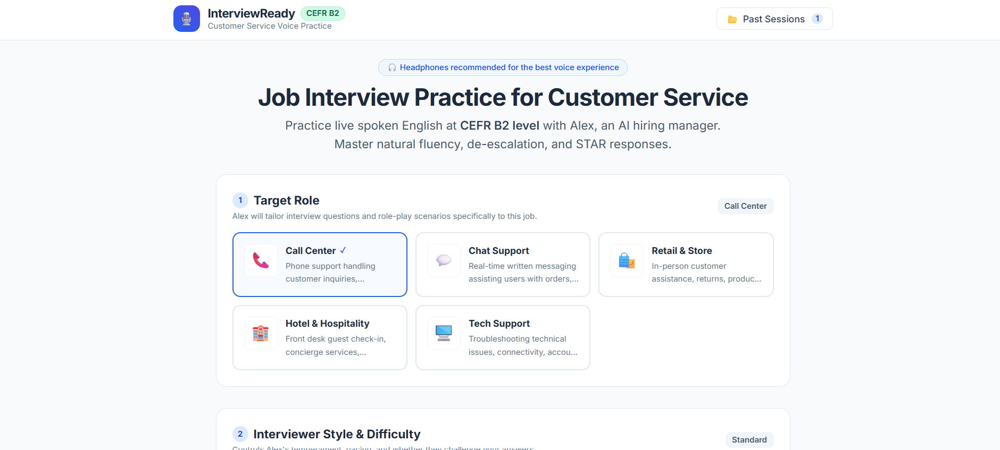
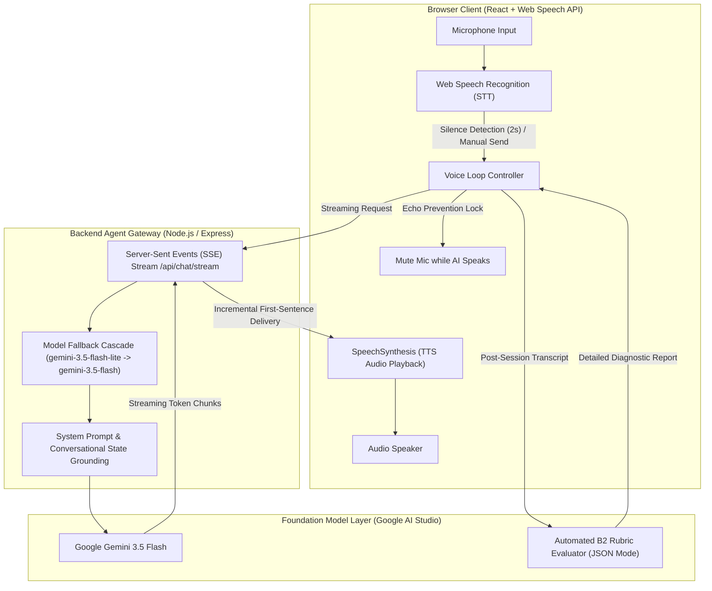

# AI Voice Interview Agent: Conversational Practice Engine

[](https://react.dev/)
[](https://aistudio.google.com/)
[-34A853.svg)]()
[](https://tailwindcss.com/)
[](https://opensource.org/licenses/MIT)

An end-to-end **Autonomous Conversational Voice Agent** for practicing job interviews in English (CEFR B2 standard for customer service and tech support roles). 

Combines browser-native **Speech-to-Text (STT)** and **Text-to-Speech (TTS)** with an event-driven **Node.js/Express** backend proxying **Google Gemini 3.5 Flash** with low-latency streaming (Server-Sent Events) and autonomous post-interview diagnostic evaluation.

---

## 🖥️ Application Interface



---

## 🎙️ Interactive Voice Loop Architecture

The system features an autonomous interviewer persona ("Alex") that conducts realistic, conversational interviews while managing voice turn-taking and echo suppression:



---

## 🧠 Key Features & Agentic Capabilities

1. **🎙️ Natural Voice Loop with Echo Cancellation:**
   * Automatically pauses mic recognition while the AI is speaking to prevent acoustic feedback loops.
   * Smart silence detection triggers message transmission after 2 seconds of pause.
   * Text-input fallback provided for non-speech environments.
2. **⚡ Ultra-Low Latency Streaming (SSE):**
   * Employs Server-Sent Events (`/api/chat/stream`) to stream AI response chunks to the frontend, allowing speech synthesis to begin as soon as the first sentence arrives.
3. **🛡️ Resilient Model Fallback Cascade:**
   * Primary: `gemini-3.5-flash-lite` (optimized for low-latency conversational turn-taking).
   * Automatic retry with exponential backoff and transparent fallback to `gemini-3.5-flash` upon 429/503 rate limit encounters.
4. **📊 Comprehensive Post-Session Diagnostic Agent:**
   * At the end of the interview, a specialized evaluator agent analyzes the complete transcript against CEFR B2 rubrics.
   * Generates a structured JSON diagnostic report:
     * **Category Scores (0–100):** Grammar accuracy, vocabulary range, fluency, STAR method alignment.
     * **Mistake Spotter:** Highlights exact candidate quotes, categorizes errors, and provides natural native rephrasings.
     * **Actionable Next Steps:** Specific practice exercises tailored to the candidate's weaknesses.

---

## 📁 Repository Structure

```
ai-voice-interview-agent/
├── client/                     # Modern React + Vite Frontend
│   ├── src/
│   │   ├── components/         # UI Screens (Interview, Feedback, ScoreRing, Transcript)
│   │   ├── hooks/              # Custom hooks (useSpeechRecognition, useSpeechSynthesis, useTimer)
│   │   ├── lib/                # Storage & constants
│   │   ├── App.jsx             # Main router & state machine
│   │   └── main.jsx
│   ├── index.html
│   ├── package.json
│   ├── tailwind.config.js
│   └── vite.config.js
├── server/                     # Express.js Backend & Gemini Gateway
│   ├── gemini.js               # Google GenAI SDK integration with fallback cascade
│   ├── prompts.js              # Persona system instructions & JSON evaluation rubrics
│   ├── index.js                # REST and SSE streaming endpoints
│   ├── package.json
│   └── .env.example            # Environment configuration template
├── .gitignore                  # Excludes node_modules, .env, and build artifacts
└── README.md                   # Technical documentation
```

---

## 🚀 Quickstart Guide

### 1. Prerequisites
- **Node.js 20+** installed
- A **Gemini API Key** (Free tier available at [Google AI Studio](https://aistudio.google.com/))
- Modern browser (Google Chrome or Microsoft Edge recommended for native Web Speech API support)

### 2. Backend Setup
```bash
cd server
copy .env.example .env
```
Open `server/.env` and insert your Gemini API key:
```env
GEMINI_API_KEY=your_actual_gemini_api_key_here
PORT=3001
```
Install dependencies and start the backend:
```bash
npm install
npm run dev
```
*Server will listen on http://localhost:3001.*

### 3. Frontend Setup
In a new terminal window:
```bash
cd client
npm install
npm run dev
```
*Frontend will launch on http://localhost:5173.*

### 4. Running the Voice Loop
1. Navigate to **http://localhost:5173** in Chrome or Edge.
2. Select your role (e.g., Customer Service Representative), difficulty, and session duration.
3. Click **"Start Voice Loop"**, grant microphone access, and speak naturally!

---

## 🛡️ Security & Credential Protection

* **Client-Side Isolation:** The Gemini API key is never bundled into client JavaScript. All AI inference is brokered through the Node.js backend.
* **Secret Hygiene:** `server/.env` is strictly ignored via `.gitignore` to prevent credential leakage.

---

## 📜 License
This project is licensed under the MIT License - see the LICENSE file for details.
